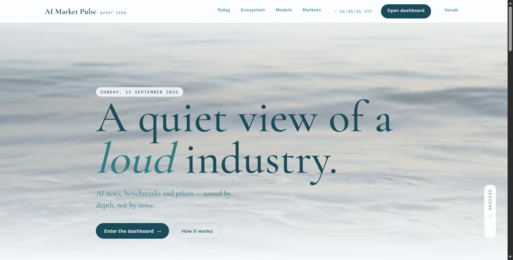
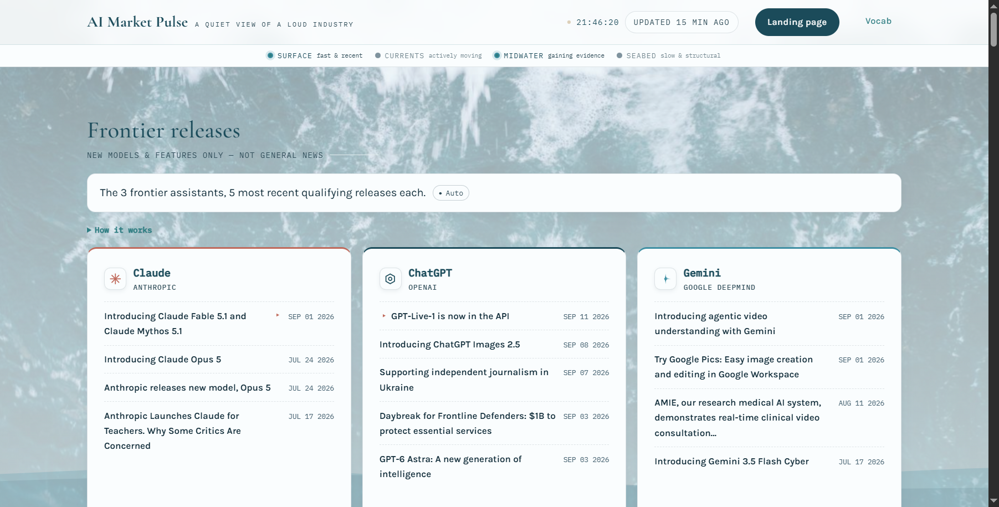
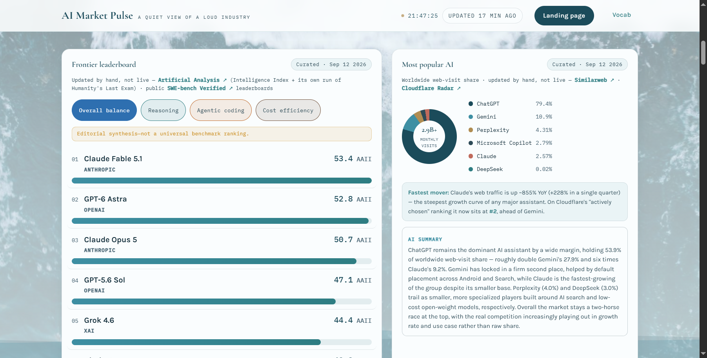
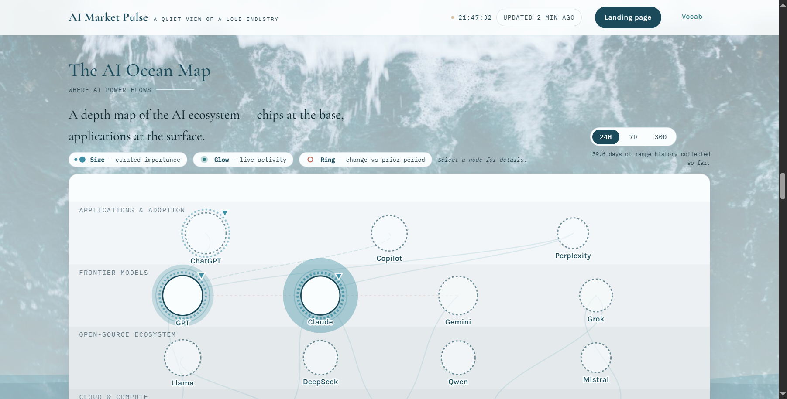
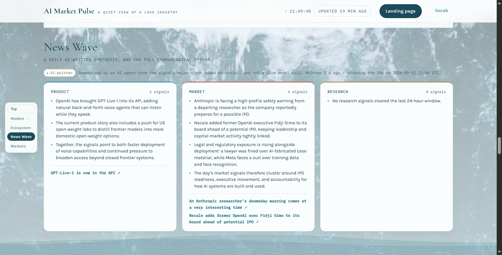
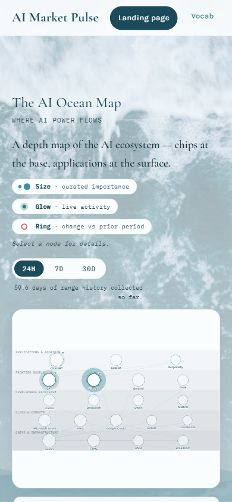
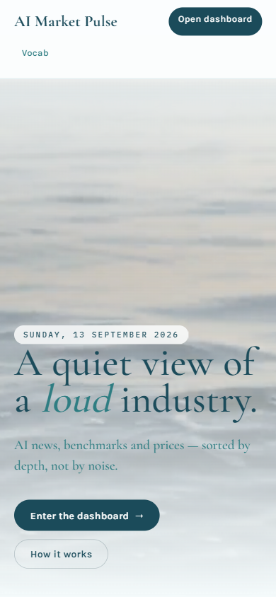
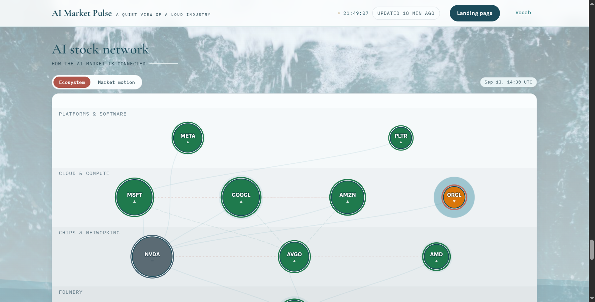
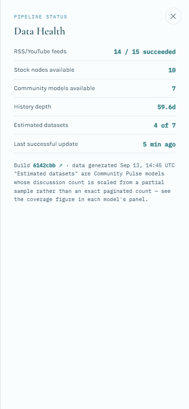
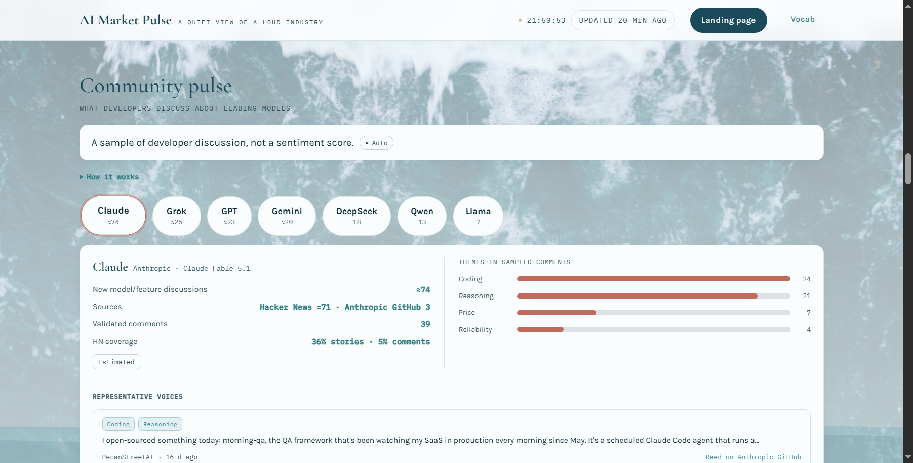

# AI Pulse: experience review and implementation plan

Reviewed 13 September 2026. Scope: landing page (`index.html`) and data page (`app.html`), with glossary integration considered where it supports those pages. This is a plan, not an implemented redesign.

## Recommendation

Make a substantial information architecture and layout overhaul while retaining the ocean palette, editorial typography, source links, and useful data visualizations. The desired experience is: **understand what changed, choose something to explore, and understand the evidence without already knowing the AI industry.**

The current site has personality and considerable information, but it asks visitors to learn its structure before receiving much value. More animations or more charts would not solve that. Prioritize reliable content, visible navigation, plain language, and purposeful interactions.

Keep the current static HTML/CSS/ES-module stack and GitHub Pages hosting. A framework migration, account system, backend, or live chatbot is unnecessary for the proposed improvements. Keep the landing page as an introduction and preview; make the data page a focused workspace with Today as its initial view.

Assumed primary visitor: an interested beginner who wants to catch up and understand AI choices. Experienced builders and researchers should still be able to reach the detailed evidence. This audience assumption should be checked with real users; no interviews or analytics were available for this review.

## Evidence and limits

I inspected the deployed landing and dashboard in Chrome, saved and opened ten screenshots, checked rendered text and layout, exercised the landing-to-ecosystem link, the 7D map control, and the Data Health drawer. Escape closed the drawer and restored focus to its trigger. Desktop measurements were approximately 1442 × 732 CSS pixels; mobile emulation was 390 × 844. Screenshot image dimensions can differ from CSS dimensions because of browser scaling.

The desktop dashboard was approximately 10,350 CSS pixels tall. News Wave began around y=5,700, after releases, multiple rankings, local hardware guidance, community discussion, and the ecosystem map. The mobile dashboard measured approximately 17,771 pixels tall, with primary navigation computed as `display:none`. These are observations from this run, not permanent performance metrics.

Local source review used checkout `7bb9a53f`. The deployed data refreshed during inspection (different build hashes appeared); the screenshots are a sequence of live states, not an atomic data snapshot. Local code confirms several presentation issues but was not assumed byte-identical to the deployed build. Model names and market figures below are audit observations, not independent verification of those facts.

Not completed: exhaustive keyboard navigation, screen-reader testing, measured contrast across every photo/video frame, network failure simulation, physical-device testing, Lighthouse/Core Web Vitals measurements, every outbound source, and every map drawer. Do not claim full accessibility compliance or a measured conversion improvement from this review.

## What is worth preserving

- A recognizable ocean identity, teal palette, and serif display headings.
- Data-driven landing previews that already share sources with the dashboard.
- Explicit curated/automatic/estimated distinctions and dataset dates.
- Real controls for map ranges, benchmark views, community selection, and source details.
- Map summaries, stock table fallback, and existing keyboard/focus code in drawers.
- Existing daily-summary freshness rules, static delivery, and extensive data tests.

## Highest-priority findings

| ID | Priority | Finding and evidence | Required change |
|---|---|---|---|
| F01 | P0 | Popularity chart says ChatGPT 79.4%, while the adjacent AI Summary says 53.9%; Gemini and Claude also disagree. Screenshot 03; hardcoded paragraph in `app.html`. | Derive factual prose from the same dataset as the chart or remove it until synchronized. |
| F02 | P0 | Local `marketShare` comment identifies StatCounter, while rendered attribution says Similarweb/Cloudflare and calls it web-visit share. The monthly-visits total is another separate figure. | Verify the actual metric, source, period, denominator, and total before relabeling. Different providers' metrics must remain separate. |
| F03 | P0 | Primary navigation is invisible at rest on desktop and absent below 900px. Screenshots 02, 06, 07; `app.html` and `js/nav.js`. | Provide persistent primary navigation and a complete mobile alternative. |
| F04 | P1 | Default dashboard starts with release lists; general news appears thousands of pixels later. Screenshot 02 and measured section offsets. | Open on a concise Today view; give detailed destinations their own focused views. |
| F05 | P1 | Landing's Ecosystem preview is popularity share, but its CTA opens the relationship map. Clicked and confirmed; screenshot 04. The landing uses Today while the data page uses News Wave. | One destination, name, and semantic purpose across both pages. |
| F06 | P1 | The mobile map is reduced to very small labels and nodes, although the page itself does not overflow at 390px. Screenshot 06. | Default to an accessible entity list on small screens; provide the map as an optional exploration view. |
| F07 | P1 | “New models & features only” includes journalism support and funding announcements; two Opus 5 release headlines appear separately. Screenshot 02. | Tighten release classification and event deduplication, with regression fixtures. |
| F08 | P1 | Large ocean backgrounds and repeated photography compete with headings, explanatory text, and charts. Screenshots 02–06, 08, 10. | Use solid reading surfaces and reserve imagery for the landing hero or small editorial accents. |
| F09 | P1 | Numeric rankings, AAII/Elo, significance, curated importance, glow, and ring encodings require prior knowledge. Screenshots 03, 04, 06. | Put a brief interpretation next to each metric; keep methodology one action away. |
| F10 | P1 | News offers no search or filtering; chronological order is clear but finding one subject requires scanning. Rendered page has no inputs; `js/river.js` confirms intentional simplification. | Add one search field and an optional filter disclosure; preserve a simple chronological default. |
| F11 | P1 | Empty Research summary occupies a full-height card alongside substantive summaries. Screenshot 05. | Collapse empty categories to a compact note; let meaningful content determine height. |
| F12 | P1 | Landing previews are mostly static rows and text source names. Its generic dashboard CTA does not carry the selected ranking category. `js/landing.js`, `index.html`. | Make headlines/source labels actionable and preserve the chosen category in the destination URL. |
| F13 | P1 | Site copy contradicts the implementation: dashboard footer calls compute curated; Community “How it works” mentions only HN despite forum/GitHub sources. | Generate provenance from shared metadata; update local help and footer together. |
| F14 | P2 | Mobile landing spends substantial space on imagery and places Vocab alone in an extra header row. Screenshot 07. | Compact the hero and use one consistent mobile header/menu. |
| F15 | P1 | Source-level failure path tells visitors to run `npm run build`; optional entities fetch can reject the combined initial load. `js/main.js`, `js/data.js`. Not failure-injected in this audit. | Independent section failures with visitor-facing Retry; keep developer diagnostics in the console. |
| F16 | P2 | Landing marquee duplicates headlines in the accessibility tree and has no explicit pause button in its markup. Hero also loops. | Prefer static headlines; otherwise supply a persistent motion control and hide redundant copies from assistive technology. |

P0 means repair before announcing the refreshed experience. P1 is required for the main redesign. P2 is finishing work or a later enhancement, not a reason to delay reliable navigation and content.

## Target page structure

### Landing: demonstrate value before asking for exploration

Use this exact order:

1. **Shared header:** brand links home; Today, Models, Ecosystem, Markets; Learn AI; one primary “Explore AI Pulse” CTA. All destination links lead to the corresponding data view. On mobile, brand, Explore, and a labeled Menu control fit in one row; the menu contains every destination.
2. **Compact hero:** headline “Understand what's happening in AI.” Supporting copy: “Catch up on important news, explore AI models, and see the sources behind the numbers.” Keep “A quiet view of a loud industry” as a smaller brand line. Primary CTA “See the latest”; secondary “Compare models.” Use the existing ocean asset as a restrained visual, with solid text backing.
3. **Latest brief:** three source-backed items using the same presentation and selection logic as Today. Each has a title, one concise explanation when available, date, and source. Show the actual coverage window. If no current synthesis exists, show recent source headlines with a clear label.
4. **Choose your next step:** three simple task links: “Find an AI model,” “Understand the ecosystem,” and “Explore markets & GPU costs.” Each includes one sentence describing the result, not a feature inventory.
5. **Model preview:** compact top-three list for the selected category; benchmark name and explanation visible. Switching Text / Image / Video / Local changes both the data and “Explore these models” destination. Avoid “best for you” claims from a general ranking.
6. **How the data works:** three short explanations: collected automatically, maintained by editors, estimates clearly marked. Link to a readable in-site methodology panel. Show source links rather than provider names as plain text.
7. **Simple footer:** navigation, Learn AI, Sources & methodology, last update. No repeated oversized closing hero.

Move raw GPU price tables and broad popularity charts off the main landing flow; the task links still make them discoverable. Replace repeated ocean-photo sections with real product content. The first useful preview should begin within the initial desktop viewport and within roughly one extra viewport on mobile; verify with realistic long headlines.

### Data page: one clear destination at a time

Primary navigation: **Today | Models | Ecosystem | Markets**. Learn AI is a utility destination. Today is the default. Use actual navigation links with URLs, not tab roles for page destinations.

Keep `app.html` and use query state for focused views. Proposed canonical links:

| Destination | URL |
|---|---|
| Today | `app.html?view=today` |
| Text models | `app.html?view=models&category=text` |
| Image models | `app.html?view=models&category=image` |
| Local models | `app.html?view=models&category=local` |
| Ecosystem relationships | `app.html?view=ecosystem&mode=map` |
| Adoption metric | `app.html?view=ecosystem&mode=adoption` |
| GPU prices | `app.html?view=markets&mode=compute` |

Only the selected top-level view is visible/focusable. Within it, use an obvious secondary selector for related content. No nested hover flyouts. Keep navigation visible during scroll. Do not recreate the previous dual-mode “full page versus panels” system: there is one focused navigation model.

**Today order:** heading and coverage/update time → latest brief → compact recent model changes → chronological news list. The list begins with 12 items and a “Show 12 more” button; no infinite scroll. Search matches headline, description, category, source name, and canonical entity aliases. A collapsed Filters area contains category, organization, and date window. Default is all loaded news, newest first; label the loaded coverage period. Do not imply that search covers the entire internet or historical data that was not loaded.

**Models order:** category selector → one-sentence explanation → benchmark/use-case selector → compact ranking list → optional comparison tray → recent releases for that category. Put Community discussion behind a secondary “Community” view, linked from model details. Make local models a hardware-fit list with PC/Phone and RAM selection, rather than presenting incompatible hardware tiers as a universal quality ranking.

**Ecosystem order:** “How the AI ecosystem connects” → Map / List / Adoption selector → one-sentence explanation of the current view → visual or list → selected entity details. Move popularity/adoption here so its landing entry has an honest destination. Keep structural relationships and attention/activity distinct. Replace global depth-status navigation with explanations inside the map where the depth metaphor is useful.

**Markets order:** Stocks / GPU prices selector. Stocks opens a straightforward table with company, price, daily change, and quote time; relationship/correlation maps are optional views. GPU prices explains rented compute in one sentence, then shows chip, hourly range, offer count, provider, and observation time. Keep quote time, collection time, and trading-session date distinct.

### Legacy navigation rules

Resolve old links before showing the view; preserve the intended target and Back/Forward behavior. Map `#panel-today` and `#sec-river` to Today; `#panel-models`, `#sec-releases`, `#tab-leaderboard`, `#sec-leaderboard` to Models; `#tab-image`, `#sec-media-image` to Image; `#tab-video`, `#sec-media-video` to Video; `#sec-media-local` to Local; `#sec-community` to Community; `#panel-ecosystem`, `#sec-map` to Ecosystem; `#panel-markets`, `#sec-stocks`, `#tab-stocknet` to Stocks; `#sec-compute`, `#tab-compute` to GPU prices; `#full` and `#top` to Today. Inventory other existing IDs before changing markup. Keep landing-local `#today`, `#models`, `#ecosystem`, `#markets`, `#surface`, and `#currents` valid or map them explicitly to the corresponding new preview.

Priority: a recognized explicit legacy target wins over conflicting query state; otherwise valid query state wins; otherwise Today. Unknown parameters safely use defaults. Use `replaceState` when normalizing old URLs and `pushState` for user navigation. Read both `popstate` and `hashchange`. Changing filter text uses `replaceState` so typing does not create dozens of Back steps. Wait only for the destination's own layout before scrolling/focusing its heading; unrelated datasets must not block navigation.

## Interaction specifications

| Interaction | Exact behavior | Empty/error behavior |
|---|---|---|
| News search | 200ms debounce; trim and case-fold; matched items stay newest first; announce result count politely. Enter need not submit a page reload. Clear returns to the current filter selection. | “No stories match these filters.” Clear filters and clear search are available. Distinguish this from a failed feed. |
| Optional news filters | Native controls under Filters; selected filters are visible as removable labels; AND between dimensions, OR within multiple values of one dimension. Reset pagination on query/filter change. | Invalid URL values fall back safely. Do not render an empty organization menu as an error. |
| Model details | Explicit Details button opens name, provider, task notes, benchmark definition/date, caveats, and direct sources. Entire paragraphs should not be mystery click targets. | Missing fields say “Not available”; missing measurement is never zero. |
| Model comparison | Select 2–3 models in the same category and benchmark context. Tray shows selections, Remove, Clear, Compare. Disable Compare below two selections and explain why. | On a fourth choice, announce “Compare up to 3 models.” On category change, clear comparison with a brief explanation. |
| Comparison display | Desktop table; on mobile stack each attribute across selected models so corresponding values remain adjacent. Use only existing verified fields. Never put AAII, Elo, and coding percentages on one common quality scale. | Mark non-comparable/missing values. Do not invent pricing, speed, or capabilities to fill cells. |
| Term help | First occurrence of a difficult term offers a named help button; opens short definition, practical example, and Learn more link to `vocab.html`. Click, keyboard, and touch all work. | Unknown terms remain plain text. Do not auto-link arbitrary substrings inside model names. |
| Map exploration | Select entity → emphasize direct links and open explanation; relation labels explain dependency/partnership/competition. Add Find entity, Reset selection, and visible List mode. | Unavailable range comparison says “Not enough history”; it must not display zero change. No recent signals is distinct from no data. |
| Mobile ecosystem | Default List at <768px. Each row: entity, layer, activity count, range, Details. User can switch to Map; minimum label size remains readable using pan/zoom if necessary. | List remains usable when visualization fails. No pinch-only essential action. |
| Local AI fit | PC/Phone and RAM selector narrow current curated rows. Show estimated memory requirement, quantization assumption, and supported setup notes already in data. Replace flip cards with disclosure sections. | “No verified match in this dataset.” Explain that RAM alone does not guarantee speed or compatibility. |
| GPU cost estimate | Optional later enhancement: input hours, multiply verified numeric hourly min/max; show currency, formula, dataset time, and excluded fees. | Do not parse arbitrary display strings into authoritative prices. Until normalized numeric fields exist, omit calculator. |
| Fresh data | If reader is filtering, comparing, or expanded in a list, show “New data available” and an Update button; apply while preserving valid state and focus. | Failed refresh retains last successful data with its real timestamp and a quiet status notice. |

Do not front-load a guided tour, signup, persona questionnaire, chat assistant, or a large filter toolbar. The older source comments record a deliberate move away from filter overload. This plan introduces only one default search and keeps advanced filtering optional. Bookmarks, watchlists, and personalization should wait until the basic task paths are validated.

## Visual specification

Use a restrained editorial direction: warm white reading surfaces, deep teal headings, sea-teal interactive accents, thin borders, and generous but purposeful space. The ocean imagery should create identity in the hero; it should not sit underneath dashboard text. Retain the existing Cormorant Garamond/Karla/IBM Plex Mono families initially to limit scope.

| Token or rule | Implementation target |
|---|---|
| Content width | Keep `--maxw:1240px`; reading passages max 65 characters wide. |
| Page surface | `--mist` for page; opaque `--panel-solid` for content. No fixed photo behind data. |
| Text | Existing `--ink` for body, `--ink-soft` for secondary; validate actual contrast. |
| Accent | `--deep` for primary CTA, `--teal` for selected/interactive elements; coral only when semantically meaningful. |
| Body type | 16px / 1.55–1.65. Metadata 13px minimum. Mono only for short metrics, dates, and identifiers. |
| Display | Hero 48–64px desktop / 36–42px mobile; section title 28–36px; card heading 20–24px. Serif for major headings, sans for data labels. |
| Spacing scale | 4, 8, 12, 16, 24, 32, 48, 64px. Desktop section gaps 48–64; mobile 32–40. |
| Cards | Radius 12px, 1px subtle border, 24px desktop / 16px mobile padding. Avoid nested cards except a distinct inset detail. |
| Controls | Minimum 44px interactive height as a product target, clear focus ring, persistent selected state. Reserve pills for filters/chips; do not make every text block a pill. |
| Grid | >=1024px: up to three brief cards, two supporting columns. 768–1023px: two columns where content fits. <768px: one column; full mobile navigation. |
| Motion | 120–180ms state transitions; no parallax or auto-moving ticker in the data page. Respect reduced-motion. Core text visible without entrance animation. |
| Charts | Explicit scale/unit/date; consistent categorical colors; visible numeric labels; no meaning conveyed only through glow/color. Share bars use a clear 0–100% scale. Tiny positive shares display `<0.1%` rather than `0.0%`. |
| Rankings | Compact rows, optional score bars; explain the scale. No full-width bar that implies 100% capability when it merely means best in this list. |

Use one set of component styles across both pages. Extract existing inline CSS into `css/landing.css` and the appropriate shared/dashboard files in small moves; preserve cascade order until verified. Remove stale comments that describe backgrounds or behavior that no longer exist. Do not layer another large override stylesheet over contradictory rules.

## Data and content contracts

Add metadata around current datasets without breaking their existing consumers. Prefer shared adapters over rewriting all data sources.

Every displayed metric needs: `metricId`, human label, definition, unit, source name and URL, observation period, updated timestamp, update method (`automatic` or `curated`), and limitations. Keep confidence/estimated status separate from update method. “Automatic” does not mean verified; “recent” does not mean real time.

For popularity, store chart rows and narrative inputs under one metric definition. The observation period and provider are mandatory. Store a monthly-visits total only if it uses the same population and period; otherwise show it as a separate named metric or omit it. “Fastest mover” requires an actual matching historical comparison; do not carry forward unrelated growth prose.

For briefing text, retain the existing precomputed AI summary model and expiry checks. Require source references that remain resolvable after the live feed rolls forward. Prefer a stable source index or embedded bounded citations with URL/title/date; do not hide citations merely because an item falls out of `latest.json`. Label date window and authorship. Do not synthesize unsupported “why it matters” claims in the browser; use validated summary content or source descriptions with clear attribution.

For release classification, use explicit product/model/feature evidence and reject unrelated grants, personnel, and general organizational updates. Keep title plus description test cases; merge duplicate announcements by normalized event identity, not brand alone. Two different features on the same date must remain separate. Repair date extraction only with source evidence, never inferred from ingestion time.

For loading, Today must not depend on entity metadata; Markets must not block Models. Curated rankings render even when live news fails. Each view has skeleton, populated, empty, stale, and error states. Surface a small Sources & freshness utility in the shared shell; keep feed counts and commit IDs inside the existing technical drawer.

## Ordered implementation tickets

Implement one ticket at a time. Each ticket should end with a short file-change summary, checks run, and any remaining failure. Later tickets depend on earlier contracts. Do not change live data values merely to make screenshots attractive.

### T00 — Capture baseline and inventory (small)

Files: `docs/reviews/2026-09-13/`, `package.json`, existing `test/` and `docs/`.

1. Read this plan, current `AGENTS.md` if present, and architecture/schema docs. Re-check the source because it may have changed since this audit.
2. Inventory IDs, deep links, dataset shapes, and duplicate CSS ownership. Record what each current test protects.
3. Run `npm run check` against checked-in data and record pre-existing failures. Do not run `npm run build` just to establish a UI baseline; it fetches and rewrites data.
4. Capture fresh desktop/mobile baselines for implementation comparison.

Done when: baseline behavior and pre-existing failures are recorded, route inventory exists, and unrelated workspace changes are protected.

### T01 — Repair trust contradictions (medium; depends T00)

Files: `app.html`, `js/curated.js`, `js/sections.js`, `js/landing.js`, `js/freshness.js`; new `js/metric-meta.js` if useful; relevant tests and schema docs.

1. Verify popularity source and metric. Introduce shared metadata; render both pages' labels, periods, and chart narrative from it.
2. Remove or regenerate the hardcoded AI Summary, growth claim, and unrelated monthly total.
3. Correct compute/footer and community-source copy from actual dataset metadata.
4. Fix tiny-share rounding and preview source links. Give automatic data explicit observation/update time.

Acceptance: changing a popularity fixture changes chart labels and narrative consistently; each page shows the same metric/provider/period; no unverified total remains; compute no longer says both curated and live. Add meaningful data/renderer consistency tests. Source verification must precede adopting a particular provider label.

### T02 — Establish the visual foundations (medium; depends T01)

Files: `css/tokens.css`, `css/shell.css`, `css/components.css`, `css/app.css`, `index.html`, `app.html`; new `css/landing.css`.

1. Apply the visual table above; remove dashboard photographic background and decorative fixed wave overlays behind reading content.
2. Extract page-local styles in logical groups; eliminate conflicting duplicate rules after checking computed styles.
3. Define shared buttons, section headings, metadata rows, empty states, and compact data rows.

Acceptance: no data-page text overlays photography; reading text is at least 16px; both pages use the same components; 320/390/768/1440px layouts have no page-level horizontal overflow. Capture before/after images. Keep chart behavior unchanged during this ticket.

### T03 — Replace navigation and add focused views (large; depends T02)

Files: `app.html`, `index.html`, `js/nav.js`, `js/deeplink.js`, `js/main.js`, `css/shell.css`; new `js/view-state.js`; update `test/continuity.test.mjs` and add route-state tests.

1. Implement canonical query state and legacy mapping defined above as pure functions.
2. Make persistent desktop navigation and mobile menu with all four primary destinations plus Learn AI. Menu is keyboard/touch operable, closes on Escape/navigation, and restores focus when dismissed.
3. Render only one visible top-level view. Reorder/move popularity into Ecosystem. Keep existing section IDs until aliases are working.
4. Add `popstate`/`hashchange`, view title, current-link indicator, and destination heading focus after intentional navigation.
5. Make view layout initialize charts after becoming visible; hidden-container dimensions must not corrupt map geometry.

Acceptance: direct load, reload, Back, Forward, and every inventoried legacy link land on the right visible content. No hidden view remains tabbable. Navigation works at 320px and with JavaScript data requests failing. Remove auto-hide navigation logic. Old tests that assert the previous page order must be replaced by equivalent new behavior checks, not blindly preserved or deleted wholesale.

### T04 — Build Today and the landing preview together (large; depends T03)

Files: `index.html`, `app.html`, `js/landing.js`, `js/aisummary.js`, `js/main.js`, `js/river.js`; new `js/briefing.js`; relevant summary/landing tests.

1. Implement the landing order and exact hero/CTA copy above.
2. Reuse a briefing adapter/presentation for both pages; show source-backed recent items when current synthesis is absent.
3. Make Today the default entry. Collapse empty summary categories and display the actual summary window.
4. Implement compact news rows with source, date, title, and short attributed explanation. Add explicit source links on landing rows.
5. Wire all preview CTAs to semantic destinations, preserving the selected model category.

Acceptance: a visitor sees useful current content before encountering benchmark machinery; missing/expired summaries do not blank Today; every preview CTA opens corresponding content; all factual text has a source or is clearly labeled editorial explanation. No fake summaries are generated as a fallback.

### T05 — Add minimal search and stable news state (medium; depends T04)

Files: `js/river.js`, `js/main.js`, `js/view-state.js`, `app.html`, shared components; new search/state unit tests and browser cases.

1. Implement the search/filter specification, URL state, counts, and pagination.
2. Preserve expanded item IDs/count and valid filter values across refresh. Replace the current reset-to-16 behavior.
3. Add the explicit new-data update control for active readers; avoid replacing focused elements during refresh.

Acceptance: search plus filters intersect correctly; empty results can be recovered in one action; clearing preserves the chronological default; reload restores a shared search; refreshing does not jump to the page top or discard an open reader state. Test malformed URL parameters and zero results.

### T06 — Make Models understandable and comparable (large; depends T03, T04)

Files: `js/sections.js`, `js/curated.js`, `app.html`, `css/components.css`, `js/vocab-data.js`; new `js/model-details.js` and `js/compare.js` as needed.

1. Add category views and benchmark explanation beside the selector; preserve raw score units/dates.
2. Replace hidden row notes as the sole explanation with an explicit Details control.
3. Add comparison tray and 2–3 model comparison using only compatible existing measurements.
4. Replace hardware flip cards with PC/Phone and RAM fit controls plus visible disclosures.
5. Add contextual term help using existing glossary content; relabel Vocab as Learn AI in the shared shell.

Acceptance: beginners can learn what the score measures without leaving their task; comparisons never mix incompatible units; same-category selection survives view reopen where valid; unknown measurements are explicit; all Details/Compare/help actions work by keyboard and touch. Do not add unsupported model recommendations or new numeric scores.

### T07 — Repair release quality and citation continuity (medium/large; depends T01)

Files: `scripts/lib/signals.mjs`, `scripts/update-data.mjs`, `scripts/lib/dates.mjs` only if evidence warrants, `js/aisummary.js`, summary preparation/validation, `test/signals.test.mjs`, `test/summary-input.test.mjs`, `test/dates.test.mjs`.

1. Add regression fixtures for the observed non-release announcements and duplicated release story. Trace whether classification, dedupe, or persisted input caused each error.
2. Improve event classification/deduplication while retaining genuine product launches and distinct feature updates.
3. Preserve summary source references when the rolling news list changes.
4. Validate the resulting checked-in schema and fixtures before any intentional live rebuild.

Acceptance: unrelated organization announcements no longer enter releases; duplicate coverage merges while distinct releases remain; old summary citations still resolve; timestamps are source-backed; existing tests pass. Manual review of a representative sample is required because keyword tests alone do not establish editorial accuracy.

### T08 — Make Ecosystem and Markets usable on small screens (large; depends T03)

Files: `js/oceanmap.js`, `js/stocknetwork.js`, `js/sections.js`, `app.html`, `css/app.css`, shared components.

1. Add entity List and search, sharing selected entity/range state with Map.
2. Make List default below 768px; preserve user's explicit choice during the current session.
3. Explain each edge/type and show selected connections with readable contrast. Keep keyboard-equivalent node details.
4. Make stock table the default and expose relationship/correlation maps as alternatives.
5. Put GPU prices in their own view with clear units, observation time, and offer counts. Defer calculator until numeric fields are normalized.

Acceptance: all entity facts are available without manipulating a map; range change updates both views; missing history is distinct from no activity; mobile labels stay readable; all ten stock records remain accessible if the map fails; correlation remains separate from business relationships. Verify modal focus and close behavior after layout changes.

### T09 — Progressive loading and accessible behavior (medium; depends T04–T08)

Files: `js/data.js`, `js/main.js`, `js/datahealth.js`, section modules, CSS and browser test fixtures.

1. Isolate fetch failures so optional entities/ranges/videos cannot prevent news or rankings rendering.
2. Add per-section Retry, last-successful timestamp, stale/empty/error states, and useful failure copy. Remove build commands from visitor errors.
3. Remove redundant marquee copies/automatic motion; verify reduced-motion behavior and core content visibility without animation.
4. Check dialog focus entry, trap, Escape, return focus, scroll behavior, and background interaction.
5. Keep Sources & freshness visible; retain technical feed/build information inside the drawer.

Acceptance: failing each dataset individually leaves other sections usable; offline refresh retains existing data with truthful status; 200% text and 400% browser zoom reflow are usable; keyboard users can complete all core flows without hidden traps. Do not label the result compliant until the required manual checks are completed.

### T10 — End-to-end review and handoff (medium; depends all required tickets)

Files: tests, docs, final screenshot set; fix only failures found in review.

1. Run `npm run check` and the new behavioral browser cases. The current suite contains source-text contracts, so passing it alone does not prove interactions.
2. Use fixed fixtures for normal data, long names, no news, missing metrics, expired summary, missing optional data, malformed timestamp, and delayed network responses.
3. Verify core routes at 320, 390, 768, and 1440px; test a real mobile device if available. Check long content, open menus, drawers, and comparison states.
4. Compare screenshots against the visual specification. Verify no missing content was hidden merely to make a page shorter.
5. Conduct the usability tasks below with 3–5 beginners if available; record observations rather than treating that small sample as statistical proof.

Acceptance: no P0/P1 defect in primary flows, complete navigation and source parity, passing checks or clearly documented unrelated baseline failures, and a short change/risk/test report. Deploy only within the user's separately authorized release workflow.

## Verification scenarios and success criteria

| Scenario | Pass condition |
|---|---|
| New visitor | Can explain the site's purpose and reach latest news without learning ocean-depth terminology. |
| Catch up | Finds three recent developments and can open their sources in about two minutes. This is a usability target, not a current measured result. |
| Find a topic | Search and clear search work; displayed count/order match loaded data. |
| Compare models | Selects two compatible models, understands benchmark meaning, and identifies a limitation. |
| Understand a term | Finds an explanation inline and returns to the same reading position. |
| Explore a company | Finds entity, understands one relationship, changes date range, sees the same values in List and Map. |
| GPU prices | Identifies hourly units, currency, provider, timestamp, and that these are rental offers. |
| Mobile navigation | Reaches any primary destination within two actions at 390px; no manual scrolling through unrelated sections is required. |
| Trust | Chart, narrative, provider, date, and denominator agree; stale data is never relabeled as fresh. |
| Failure recovery | One failed optional request does not blank another view; Retry is understandable. |
| Browser history | Direct links, refresh, Back, Forward, and old bookmarks preserve the intended destination. |
| Accessibility | All core controls have accessible names, visible focus, keyboard operation, and readable reflow; test results recorded. |

Accessibility references checked during this review: [W3C reflow guidance](https://www.w3.org/WAI/WCAG22/Understanding/reflow.html), [modal dialog interaction pattern](https://www.w3.org/WAI/ARIA/apg/patterns/dialog-modal/), and [pause/stop/hide guidance](https://www.w3.org/WAI/WCAG22/Understanding/pause-stop-hide.html). These support narrow-layout testing, predictable modal focus, and controls for persistent automatic motion; they are not a certification of this site.

If analytics already exist, measure landing-to-content clicks, successful searches, comparison use, and source opens with a clear denominator. Do not add tracking as part of this plan without a separate product decision. Avoid optimizing for raw scroll depth or time on page: faster understanding may reduce both.

## Delivery slices and things to defer

- **Slice A: trustworthy and navigable:** T00–T03 plus release repair from T07. This fixes contradictions and access problems.
- **Slice B: useful to a beginner:** T04–T06 and citation continuity from T07. This provides the daily entry point, explanations, and comparison.
- **Slice C: refined across devices:** T08–T10. This completes mobile visualization, failure handling, and verification.

Each large ticket can span several implementation sessions. Treat small/medium/large as relative scope, not guaranteed elapsed time. Keep a progress checklist and stop each session at a tested boundary.

Defer accounts, subscriptions, notifications, portfolio tools, recommendations based on invented user profiles, live AI chat, a framework migration, advanced chart builders, and visual effects. They add scope without repairing the reviewed friction. GPU cost estimation and local saved views are reasonable later experiments once underlying data and navigation are reliable.

## Copy-paste instruction for the implementing model

> Read `docs/reviews/2026-09-13/IMPROVEMENT-PLAN.md`. Implement ticket T00 first, then the tickets in the listed dependency order. Work on one ticket at a time and update a progress checklist after each. Preserve the static HTML/CSS/ES-module stack and existing dataset semantics. Follow the specified routes, page order, component behavior, and visual tokens rather than inventing a different redesign. Do not generate facts, benchmark scores, sources, summaries, or prices. Reuse existing data and glossary definitions; show missing fields honestly. Keep old links working. Update obsolete structural tests with equivalent behavioral coverage, preserve relevant data tests, and run the required checks. Capture desktop and mobile evidence at each major UI milestone. Report changed files, checks, and unresolved issues before moving to the next ticket. Do not deploy or run an unnecessary live-data rebuild.

## Screenshot walkthrough

These are current-site evidence, not proposed mockups. Screenshots were saved and visually inspected. Numbering identifies captures; the walkthrough below follows a practical reading order.

### 1. Landing entry — visually distinctive, weak immediate utility

The hero clearly communicates tone and provides a CTA, but the first viewport is dominated by the slogan and scenery. The benefit should be more concrete and a useful preview closer. Text over moving imagery needs measured contrast checks.

### 2. Dashboard entry — content-rich, difficult orientation

Release cards are organized by provider and offer links, but the initial screen lacks an obvious persistent route to the rest of the product. Some listed items conflict with the stated release-only scope. Headings sit over detailed photography.

### 3. Rankings and popularity — useful data, serious trust problem

Benchmark choices and source links are strengths. The hardcoded adjacent narrative contradicts visible chart percentages. Score interpretation, table density, and chart scale need clearer explanation.

### 4. Landing-to-ecosystem destination — working link, mismatched expectation

Clicking the landing popularity preview's Ecosystem CTA opened this relationship map. The map has a legend and meaningful controls, but does not continue the promised popularity view. Multiple simultaneous visual encodings increase learning effort.

### 5. News and daily summary — valuable, buried and uneven

Source-linked summaries are useful. The empty Research panel takes the same height as substantive content; long methodological text sits on photography. Move this content into Today, shorten the explanation, and collapse empty categories.

### 6. Mobile ecosystem — technically fits, difficult to use

At 390px there was no page-level horizontal overflow, but map labels shrink severely and primary navigation is absent. The 7D control did update selected state and the text summary in the interaction check. List mode should carry the essential mobile experience.

### 7. Mobile landing — readable headline, excessive vertical space

Primary CTA remains usable, but the Vocab link creates a second header row and the hero pushes utility down. A complete mobile menu and shorter hero would improve orientation without sacrificing identity.

### 8. Markets — rich relationships, weak quick lookup

The stock map is an interesting secondary view. Price lookup should start with a readable table and clear trading timestamps. Map lines and colors require further contrast/keyboard verification.

### 9. Data Health — good functional foundation

The mobile drawer opened, focused its close control, closed on Escape, and restored focus to Data Health. Its concise technical details are useful; expose a simpler Sources & freshness entry earlier. Full focus trapping and background inertness still need verification.

### 10. Community — transparent sample, heavy presentation

The source split, estimated marker, and explicit non-sentiment framing are strengths. Large selector bubbles and repeated intro blocks consume space. Move this to a model-related secondary view, use compact selection controls, and keep sampling limitations next to the interpretation.

